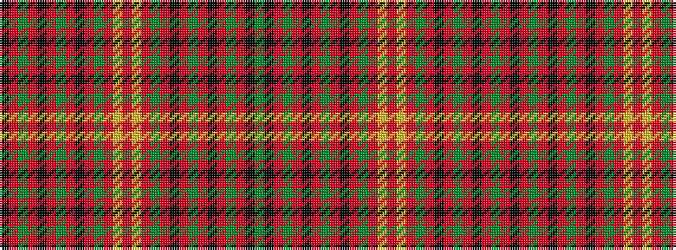

GKRGRKRGRKRGRYRYRGRKRGRKRGRK

It is a 28 stripe tartan.

<figure class="pat-woven">

<figcaption>idealised sample</figcaption>
</figure>

## Colour Sequence



## Tartans with this colour sequence

| Tartans |
|---------------|
| [Williams Welsh Name Tartan](/variants/s28/k2r30g2r3k2r6g1r6k2r3g2r13ly2r26ly2r13g2r3k2r6g1r6k2r3g2r30k2g2~x2/)|
||
| [Williams of Wales](/variants/s28/k2r30dg2r3k2r6dg1r6k2r3dg2r13ly2r26ly2r13dg2r3k2r6dg1r6k2r3dg2r30k2dg2~x2/)|
||
