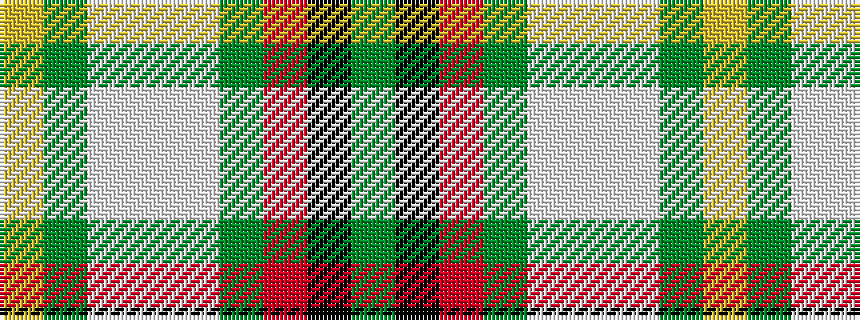

GKRGWWWGY

It is a 9 stripe tartan.

<figure class="pat-woven">

<figcaption>idealised sample</figcaption>
</figure>

## Colour Sequence



## Tartans with this colour sequence

| Tartans |
|---------------|
| [Taylor Dress #2](/setts/s9/dg9k2r4dg14w3lp3w23dg5ly3~x2/)|
||
| [Taylor, dress](/setts/s9/g9k2r4g14w3lp3w23g5ly3~x2/)|
||
