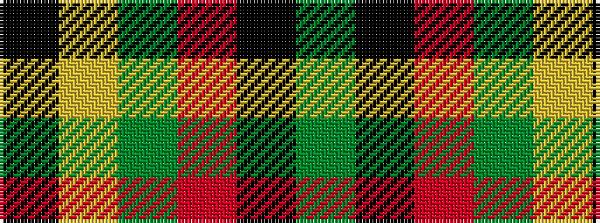

GKRGYK

It is a 6 stripe tartan.

<figure class="pat-woven">

<figcaption>idealised sample</figcaption>
</figure>

## Colour Sequence



## Tartans with this colour sequence

| Tartans |
|---------------|
| [MacMillan - 2002 (Black - Unofficial](/setts/s6/k3lo18dg6r17k31dg3~x2/)|
||
| [MacMillan Variant (Unidentified)](/setts/s6/k3ly18g6r17k31g3~x2/)|
||
| [MacMillan Varient (Unidentified)](/setts/s6/k3ly18dg6r17k31dg3~x2/)|
||
