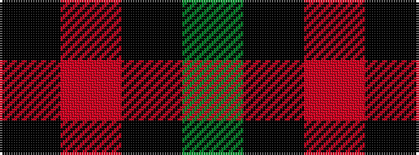

GKRK

It is a 4 stripe tartan.

<figure class="pat-woven">

<figcaption>idealised sample</figcaption>
</figure>

## Colour Sequence



## Tartans with this colour sequence

| Tartans |
|---------------|
| [Red Watch (Fashion) #1](/variants/s4/g6k2r3k1~x4/)|
||
