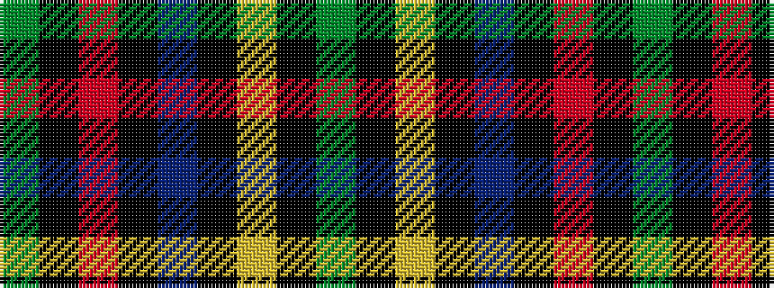

GKRKBKYKG

It is a 9 stripe tartan.

<figure class="pat-woven">

<figcaption>idealised sample</figcaption>
</figure>

## Colour Sequence



## Tartans with this colour sequence

| Tartans |
|---------------|
| [Granvert](/setts/s9/dg115k15r8k4b8k4ly8k4g8~x2/)|
||
