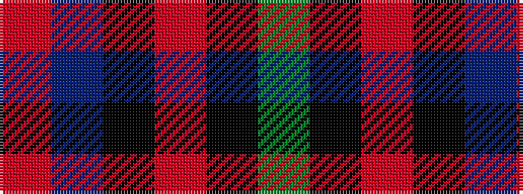

GKRKBR

It is a 6 stripe tartan.

<figure class="pat-woven">

<figcaption>idealised sample</figcaption>
</figure>

## Colour Sequence



## Tartans with this colour sequence

| Tartans |
|---------------|
| [Drambuie hunting](/setts/s6/o6dr36k48r4k5y6/)|
||
