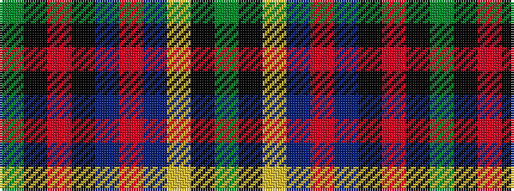

GKRKBRBYKG

It is a 10 stripe tartan.

<figure class="pat-woven">

<figcaption>idealised sample</figcaption>
</figure>

## Colour Sequence



## Tartans with this colour sequence

| Tartans |
|---------------|
| [Mead (Tennessee) Hunting (Personal)](/variants/s10/dy36k3o6k3do10o5do3lo4k1dy2~x2/)|
||
