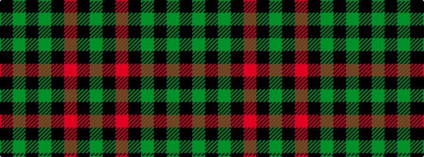

GKRKGKGK

It is a 8 stripe tartan.

<figure class="pat-woven">

<figcaption>idealised sample</figcaption>
</figure>

## Colour Sequence



## Tartans with this colour sequence

| Tartans |
|---------------|
| [Glenbarr](/variants/s8/g3k6r2k6g3k2g16k1~x4/)|
||
