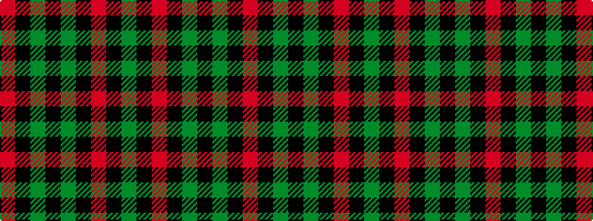

GKRKGKGKR

It is a 9 stripe tartan.

<figure class="pat-woven">

<figcaption>idealised sample</figcaption>
</figure>

## Colour Sequence



## Tartans with this colour sequence

| Tartans |
|---------------|
| [Borthwick](/variants/s9/g12k2r12k3y12k16y12k3r6~x2/)|
||
| [Borthwick](/variants/s9/g17k1r16k2y14k19y14k2r6~x2/)|
||
| [Borthwick](/variants/s9/dg17k1r16k2y14k19y14k2r6/)|
||
| [Borthwick D](/variants/s9/dg12k1r10k2y10k14y10k2r4~x2/)|
||
