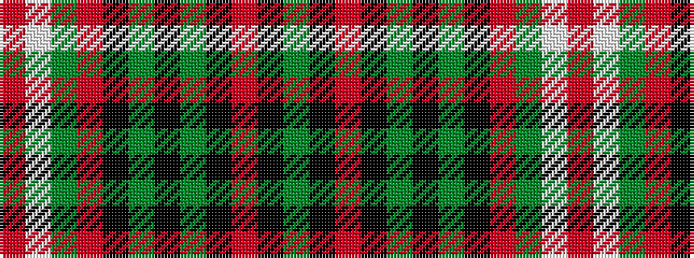

GKRKGKGKRGWR

It is a 12 stripe tartan.

<figure class="pat-woven">

<figcaption>idealised sample</figcaption>
</figure>

## Colour Sequence



## Tartans with this colour sequence

| Tartans |
|---------------|
| [Otago Peninsula](/setts/s12/dg4k4m4k2dg12k2dg12k2m4dg4w1r4~x2/)|
||
