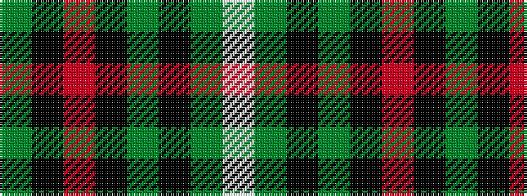

GKRKGKGW

It is a 8 stripe tartan.

<figure class="pat-woven">

<figcaption>idealised sample</figcaption>
</figure>

## Colour Sequence



## Tartans with this colour sequence

| Tartans |
|---------------|
| [MacAulay of Lewis](/setts/s8/g6k16r3k16g28k4g12w3~x2/)|
||
