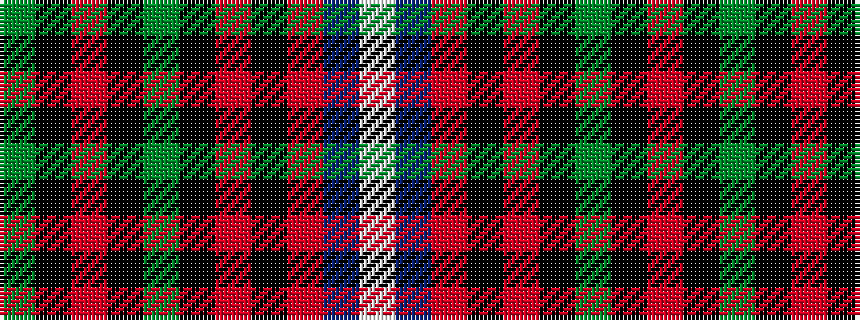

GKRKGKRKRBW

It is a 11 stripe tartan.

<figure class="pat-woven">

<figcaption>idealised sample</figcaption>
</figure>

## Colour Sequence



## Tartans with this colour sequence

| Tartans |
|---------------|
| [Storrie (Name)](/setts/s11/g20k1o1k1g20k10o2k2r2db20w1~x2/)|
||
