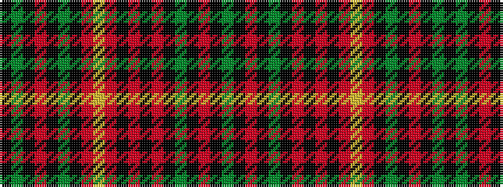

GKRKGKRKRKRYRKGKRKGK

It is a 20 stripe tartan.

<figure class="pat-woven">

<figcaption>idealised sample</figcaption>
</figure>

## Colour Sequence



## Tartans with this colour sequence

| Tartans |
|---------------|
| [Austrian Bowhunters Htg (Corp)](/setts/s20/g40k2r3k2g3k3r3k3r3k3r5ly1r5k3g3k2r3k2g3k3~x2/)|
||
| [Austrian Bowhunters Hunting](/setts/s20/dg40k2r3k2dg3k3r3k3r3k3r5ly1r5k3dg3k2r3k2dg3k3~x2/)|
||
