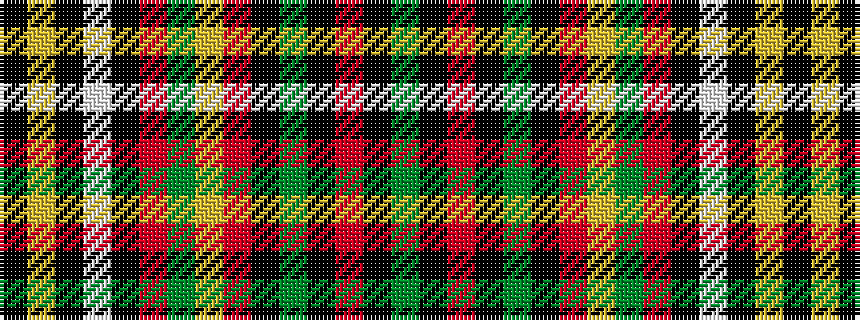

GKRKGKRYGRKWKYK

It is a 15 stripe tartan.

<figure class="pat-woven">

<figcaption>idealised sample</figcaption>
</figure>

## Colour Sequence



## Tartans with this colour sequence

| Tartans |
|---------------|
| [Belk Heritage (Fashion)](/variants/s15/k16lo1k4lb2k4r1dg41lo2r36k1dg3k1r3k1dg4~x2/)|
||
