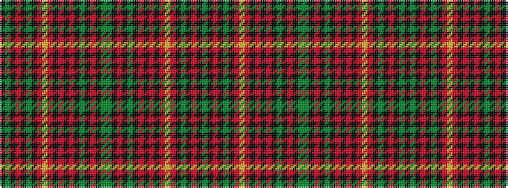

GKRKGKRYRKRKRKGKRKGGKRKGKRKRKRYRKGKRKGK

It is a 39 stripe tartan.

<figure class="pat-woven">

<figcaption>idealised sample</figcaption>
</figure>

## Colour Sequence



## Tartans with this colour sequence

| Tartans |
|---------------|
| [Austrian Bowhunters Hunting Corporate Tartan Tartan Number: 6460. Earliest known date: October 2004 Designed online by Andrea Egelkraut for the Austrian Bowhunters. See products available Copyright © Blair Urquhart, Comrie, 2015](/setts/s39/k3dg3k2ri3k2dg3k3ri5ly1ri5k3r3k3r3k3dg3k2ri3k2dg20dg20k2ri3k2dg3k3r3k3r3k3ri5ly1ri5k3dg3k2ri3k2dg3~x2/)|
||
