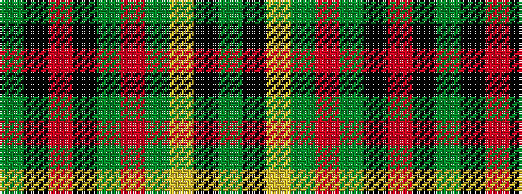

GKRKGRGYKG

It is a 10 stripe tartan.

<figure class="pat-woven">

<figcaption>idealised sample</figcaption>
</figure>

## Colour Sequence



## Tartans with this colour sequence

| Tartans |
|---------------|
| [Mead Hunting (Personal)](/setts/s10/dy36k3o6k3dy10o5dy3lo4k1dy2~x2/)|
||
