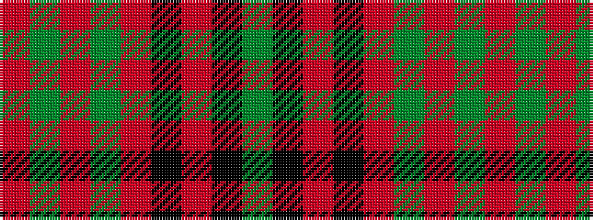

GKRKRGRGR

It is a 9 stripe tartan.

<figure class="pat-woven">

<figcaption>idealised sample</figcaption>
</figure>

## Colour Sequence



## Tartans with this colour sequence

| Tartans |
|---------------|
| [Livingston](/setts/s9/dg20k2r3k2r6dg20r29dg3r10~x2/)|
||
| [Livingston](/setts/s9/g20k2r3k2r6g20r29g3r10~x2/)|
||
