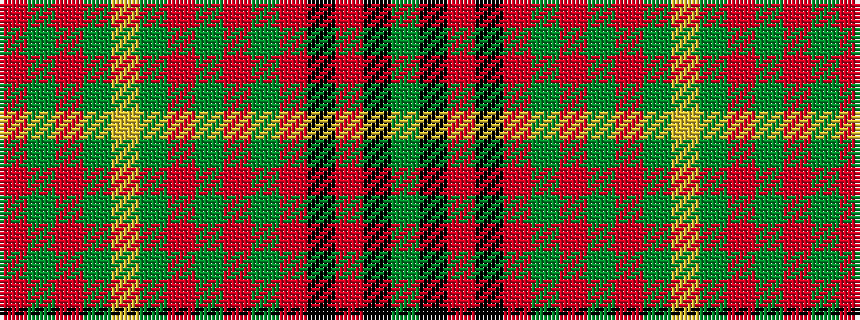

GKRKRGRGRGYGRGR

It is a 15 stripe tartan.

<figure class="pat-woven">

<figcaption>idealised sample</figcaption>
</figure>

## Colour Sequence



## Tartans with this colour sequence

| Tartans |
|---------------|
| [Ensign, of Ontario](/variants/s15/g21k1r4k1o21g3o3g3o21g3ly4g21o3g3o3~x2/)|
||
