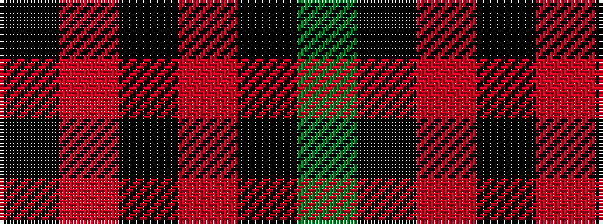

GKRKRK

It is a 6 stripe tartan.

<figure class="pat-woven">

<figcaption>idealised sample</figcaption>
</figure>

## Colour Sequence



## Tartans with this colour sequence

| Tartans |
|---------------|
| [Allt Dubh (Black Burn)](/setts/s6/k99r5k4r3k2y1~x2/)|
||
