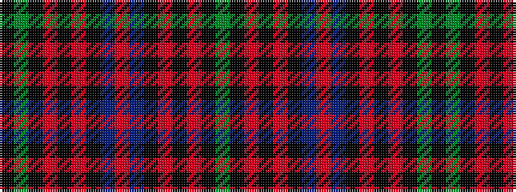

GKRKRKBRBKRKRKGK

It is a 16 stripe tartan.

<figure class="pat-woven">

<figcaption>idealised sample</figcaption>
</figure>

## Colour Sequence



## Tartans with this colour sequence

| Tartans |
|---------------|
| [Guthrie](/variants/s16/g12k12r1k1r1k12b12r1b12k12r1k1r1k12g12k1~x4/)|
||
