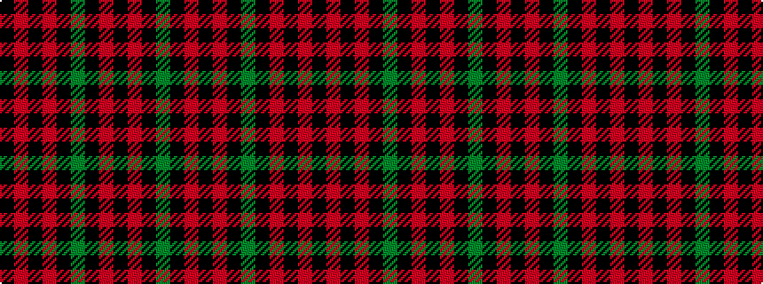

GKRKRKGKRKRK

It is a 12 stripe tartan.

<figure class="pat-woven">

<figcaption>idealised sample</figcaption>
</figure>

## Colour Sequence



## Tartans with this colour sequence

| Tartans |
|---------------|
| [O'Boyle](/variants/s12/k45m9k12r1k1g12k1r1k12m9k45g9~x2/)|
||
