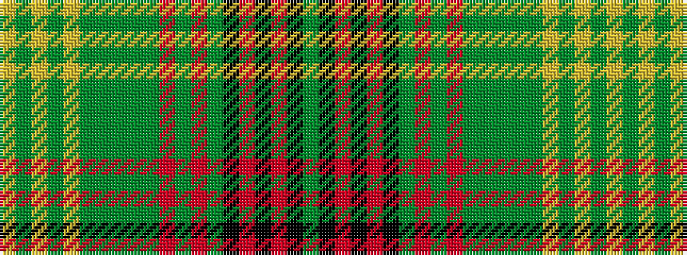

GKRKRKGRGRGGGGGYGYGY

It is a 20 stripe tartan.

<figure class="pat-woven">

<figcaption>idealised sample</figcaption>
</figure>

## Colour Sequence



## Tartans with this colour sequence

| Tartans |
|---------------|
| [Spice of Life](/setts/s20/dg10k1o1k3o1k1dg1o1dg3o1dg1y1dy3y1dy1lr1y3lr1y1lr10~x4/)|
||
