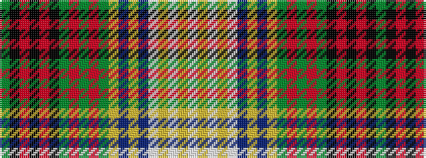

GKRKRKGRGRGYBYBWYWYW

It is a 20 stripe tartan.

<figure class="pat-woven">

<figcaption>idealised sample</figcaption>
</figure>

## Colour Sequence



## Tartans with this colour sequence

| Tartans |
|---------------|
| [Spice of Life (Fashion)](/variants/s20/g10k1r1k3r1k1g1r1g3r1g1ly1n3ly1n1w1ly3w1ly1w10~x4/)|
||
