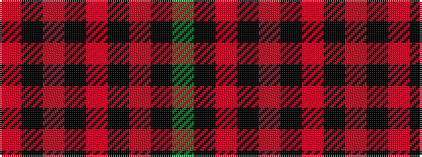

GKRKRKRKR

It is a 9 stripe tartan.

<figure class="pat-woven">

<figcaption>idealised sample</figcaption>
</figure>

## Colour Sequence



## Tartans with this colour sequence

| Tartans |
|---------------|
| [Borthwick](/variants/s9/dg12k2r12k3o12k16o12k3r6~x2/)|
||
| [Borthwick (Clan)](/variants/s9/g17k1r16k2o14k19o14k2r6~x2/)|
||
| [Borthwick Family Tartan](/variants/s9/g12k2m12k3o12k16o12k3m6~x2/)|
||
