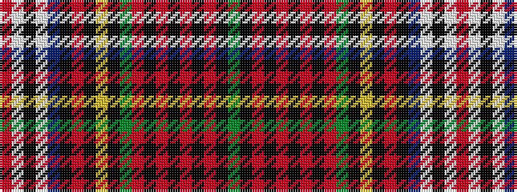

GKRKRKRKRGKYKRKBWKWR

It is a 20 stripe tartan.

<figure class="pat-woven">

<figcaption>idealised sample</figcaption>
</figure>

## Colour Sequence



## Tartans with this colour sequence

| Tartans |
|---------------|
| [Quadra](/variants/s20/g4k3r1k3r2k2r4k1r4g3k2lo2k2r2k6db6lb14k3lb3r3~x2/)|
||
