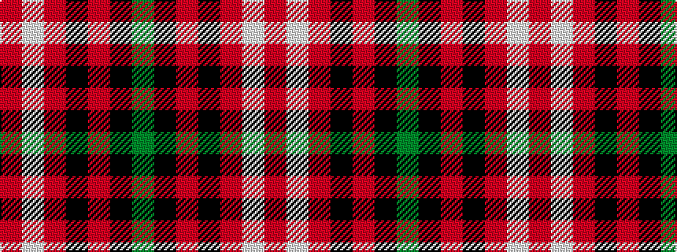

GKRKRWR

It is a 7 stripe tartan.

<figure class="pat-woven">

<figcaption>idealised sample</figcaption>
</figure>

## Colour Sequence



## Tartans with this colour sequence

| Tartans |
|---------------|
| [Instakilt, Red (Fashion)](/variants/s7/r8w4r50k12r4k15g5~x2/)|
||
