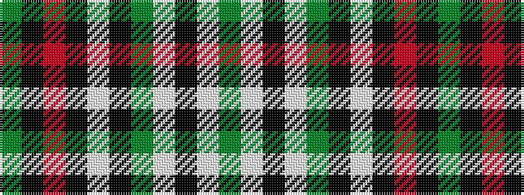

GKRKWKGWKWG

It is a 11 stripe tartan.

<figure class="pat-woven">

<figcaption>idealised sample</figcaption>
</figure>

## Colour Sequence



## Tartans with this colour sequence

| Tartans |
|---------------|
| [Laggen Dress](/setts/s11/y42k10r2k2lb2k2y10lb6k2lb3y2~x2/)|
||
