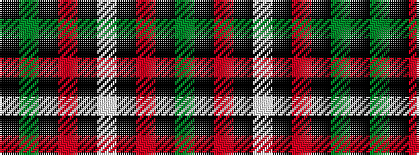

GKRKWKRKGK

It is a 10 stripe tartan.

<figure class="pat-woven">

<figcaption>idealised sample</figcaption>
</figure>

## Colour Sequence



## Tartans with this colour sequence

| Tartans |
|---------------|
| [Henkel](/setts/s10/y28k3r22k8w3k8r22k3y28k3~x2/)|
||
