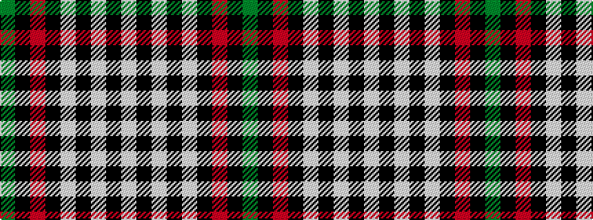

GKRKWKWKW

It is a 9 stripe tartan.

<figure class="pat-woven">

<figcaption>idealised sample</figcaption>
</figure>

## Colour Sequence



## Tartans with this colour sequence

| Tartans |
|---------------|
| [Borthwick Dress](/variants/s9/g12k2r12k3w7k16w7k3w6~x2/)|
||
| [Borthwick Dress (Clan)](/variants/s9/g7k1r8k2w7k10w7k2w4~x4/)|
||
| [Borthwick Dress Artifact Tartan](/variants/s9/g7k1m7k1w7k10w7k2w4~x2/)|
||
| [Borthwick, dress](/variants/s9/g7k1r7k1w7k10w7k2w4~x2/)|
||
