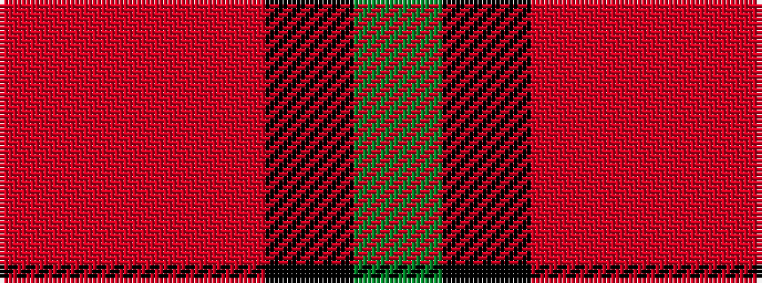

GKRRR

It is a 5 stripe tartan.

<figure class="pat-woven">

<figcaption>idealised sample</figcaption>
</figure>

## Colour Sequence



## Tartans with this colour sequence

| Tartans |
|---------------|
| [Herbage Family Tartan](/variants/s5/g25k8o10r1o3~x4/)|
||
| [Herbage of Laggan (Personal)](/variants/s5/g68k22o28r3o12~x2/)|
||
