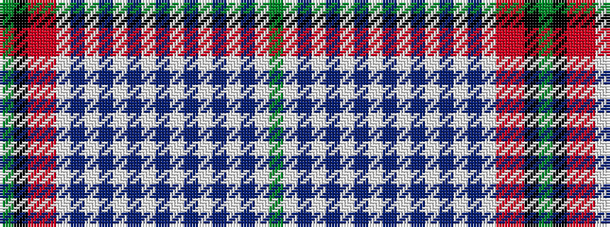

GKRRWBWBWBWBWBWBWBWG

It is a 20 stripe tartan.

<figure class="pat-woven">

<figcaption>idealised sample</figcaption>
</figure>

## Colour Sequence



## Tartans with this colour sequence

| Tartans |
|---------------|
| [Gallacher, (Name)](/setts/s20/g7w1b7w2b6w3b5w4b4w5b3w6b2w7b1w8r31ri31k10g4~x2/)|
||
