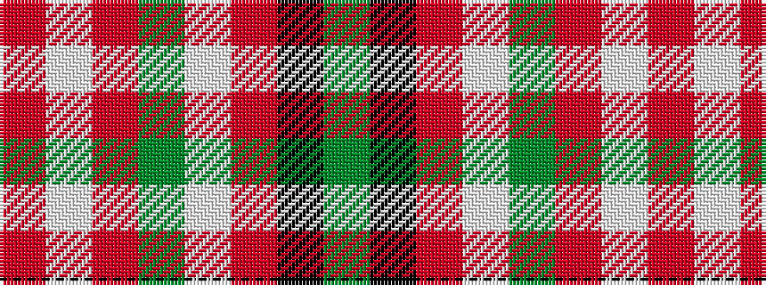

GKRWGRWR

It is a 8 stripe tartan.

<figure class="pat-woven">

<figcaption>idealised sample</figcaption>
</figure>

## Colour Sequence



## Tartans with this colour sequence

| Tartans |
|---------------|
| [MacByrd (Personal)](/setts/s8/y50k1r12lb1y12r14lb1r2~x4/)|
||
