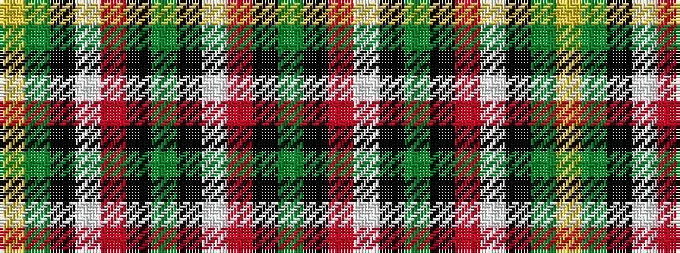

GKRWKGKRWKGY

It is a 12 stripe tartan.

<figure class="pat-woven">

<figcaption>idealised sample</figcaption>
</figure>

## Colour Sequence



## Tartans with this colour sequence

| Tartans |
|---------------|
| [Schwarzen Keiler, Die](/variants/s12/dg6k6r1w1k6dg32k6r1w1k6dg6ly2~x4/)|
||
