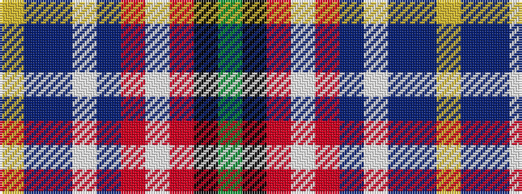

GKRWRBWBBY

It is a 10 stripe tartan.

<figure class="pat-woven">

<figcaption>idealised sample</figcaption>
</figure>

## Colour Sequence



## Tartans with this colour sequence

| Tartans |
|---------------|
| [Festival Intercltico de Avils (Coror](/variants/s10/g2k1r5w7r1db10w1db10b30ly1~x2/)|
||
