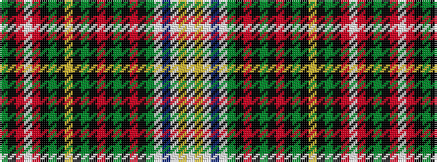

GKRWRKGKYKGKRKGKRKGWBWYW

It is a 24 stripe tartan.

<figure class="pat-woven">

<figcaption>idealised sample</figcaption>
</figure>

## Colour Sequence



## Tartans with this colour sequence

| Tartans |
|---------------|
| [MacMaster](/setts/s24/g34k1r4w1r4k1g4k1ly2k1g7k1r3k1g3k1r3k1g3w1db5w1ly4w2~x2/)|
||
| [MacMaster (USA) #2](/setts/s24/dg34k1r4w1r4k1dg4k1ly2k1dg7k1r3k1dg3k1r3k1dg3w1db5w1ly4w2~x2/)|
||
