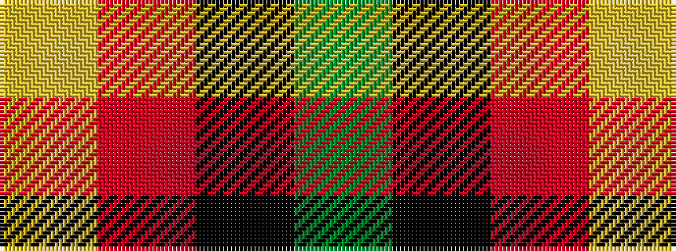

GKRY

It is a 4 stripe tartan.

<figure class="pat-woven">

<figcaption>idealised sample</figcaption>
</figure>

## Colour Sequence



## Tartans with this colour sequence

| Tartans |
|---------------|
| [Bacon, Green (Fashion)](/variants/s4/g14k3r3lr2~x2/)|
||
