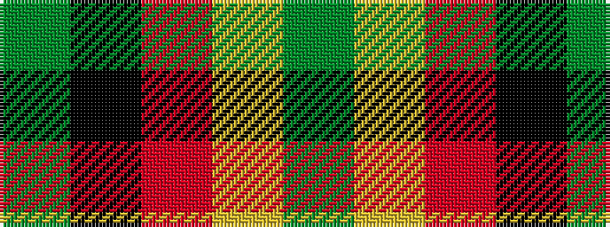

GKRYG

It is a 5 stripe tartan.

<figure class="pat-woven">

<figcaption>idealised sample</figcaption>
</figure>

## Colour Sequence



## Tartans with this colour sequence

| Tartans |
|---------------|
| [Ikelman No 2](/setts/s5/y26k10r10ly10y3~x2/)|
||
| [Ikelman No 3](/setts/s5/y5k2r2ly2y5~x10/)|
||
