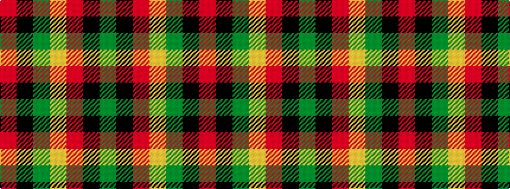

GKRYGKR

It is a 7 stripe tartan.

<figure class="pat-woven">

<figcaption>idealised sample</figcaption>
</figure>

## Colour Sequence



## Tartans with this colour sequence

| Tartans |
|---------------|
| [Londonderry](/variants/s7/r6k2g12lo8r5k2g3~x4/)|
||
| [Londonderry, County](/variants/s7/o6k2dg12lo8o5k2dg3~x4/)|
||
| [Londonderry, County (District)](/variants/s7/o6k2g12lo8o5k2g3~x4/)|
||
