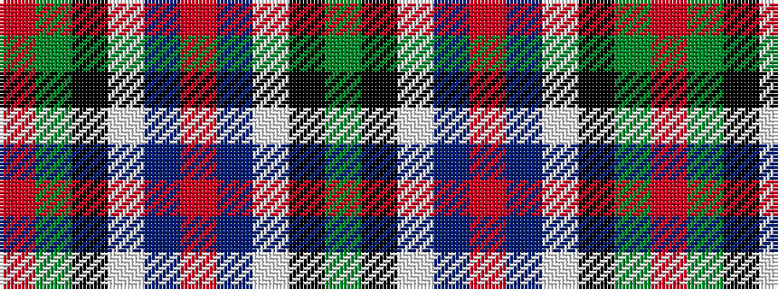

GKWBRBWKGR

It is a 10 stripe tartan.

<figure class="pat-woven">

<figcaption>idealised sample</figcaption>
</figure>

## Colour Sequence



## Tartans with this colour sequence

| Tartans |
|---------------|
| [Sinclair](/setts/s10/r30g12k5w2db6r30db12w2k5g12~x2/)|
||
