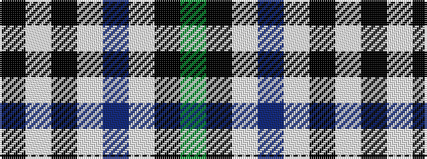

GKWBWKWK

It is a 8 stripe tartan.

<figure class="pat-woven">

<figcaption>idealised sample</figcaption>
</figure>

## Colour Sequence



## Tartans with this colour sequence

| Tartans |
|---------------|
| [Anzac (Fashion)](/setts/s8/k21lb2k4lb4do2lb4k13g2~x4/)|
||
