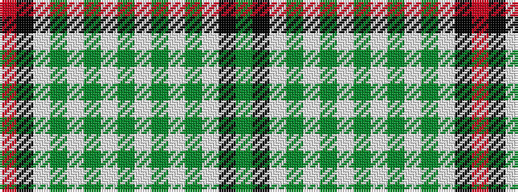

GKWGWGWGWGWGWKR

It is a 15 stripe tartan.

<figure class="pat-woven">

<figcaption>idealised sample</figcaption>
</figure>

## Colour Sequence



## Tartans with this colour sequence

| Tartans |
|---------------|
| [Alliance of Border Scots (Corporate)](/setts/s15/o1k6w1dy1w1dy1w1dy1w1dy1w1dy1w1k6g1~x8/)|
||
