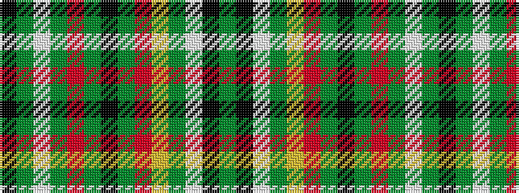

GKWGYRGKGRGWGK

It is a 14 stripe tartan.

<figure class="pat-woven">

<figcaption>idealised sample</figcaption>
</figure>

## Colour Sequence



## Tartans with this colour sequence

| Tartans |
|---------------|
| [Mauchline](/setts/s14/dy24k4w7dy7lo4o28dy7k29dy35r7dy7w4dy4k17/)|
||
