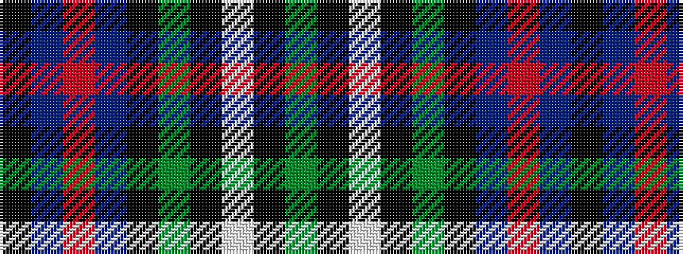

GKWKGKBRBK

It is a 10 stripe tartan.

<figure class="pat-woven">

<figcaption>idealised sample</figcaption>
</figure>

## Colour Sequence



## Tartans with this colour sequence

| Tartans |
|---------------|
| [MacPhail Hunting Corporate Tartan Tartan Number: 2158. Earliest known date: 1994 A modern interpretation of the MacPhail tartan in hunting colours produced for the whisky merchants, Gordon and MacPhail, by the weaving firm, Johnstons of Elgin. See products available Copyright © Blair Urquhart, Comrie, 2015](/setts/s10/g48k3w8k3g48k34dt60r4dt60k34/)|
||
