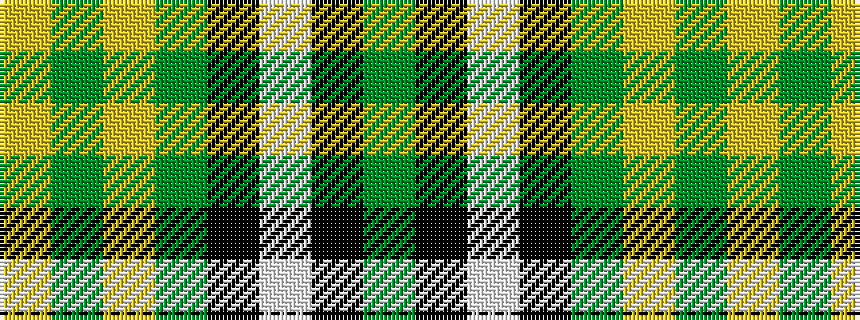

GKWKGYGY

It is a 8 stripe tartan.

<figure class="pat-woven">

<figcaption>idealised sample</figcaption>
</figure>

## Colour Sequence



## Tartans with this colour sequence

| Tartans |
|---------------|
| [Sidney, (Nova Scotia)](/setts/s8/y16k4w2k4y6lo11y2lo16~x2/)|
||
