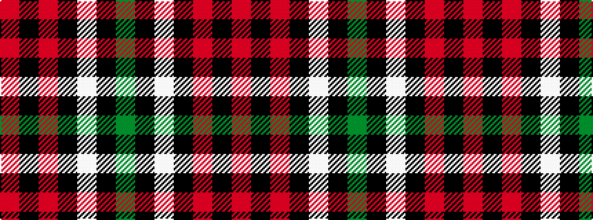

GKWKRKR

It is a 7 stripe tartan.

<figure class="pat-woven">

<figcaption>idealised sample</figcaption>
</figure>

## Colour Sequence



## Tartans with this colour sequence

| Tartans |
|---------------|
| [Aviemore Highland (Corporate)](/variants/s7/dg40k3w1k5r1k2ri10~x2/)|
||
