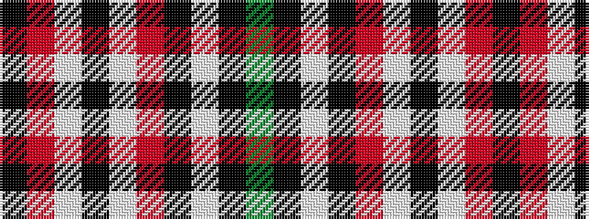

GKWKRWKWRK

It is a 10 stripe tartan.

<figure class="pat-woven">

<figcaption>idealised sample</figcaption>
</figure>

## Colour Sequence



## Tartans with this colour sequence

| Tartans |
|---------------|
| [Stuart/Stewart navy](/variants/s10/k37r4w9k2w2o9k4w2k2dy2~x2/)|
||
