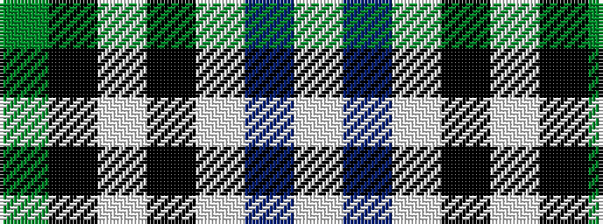

GKWKWBW

It is a 7 stripe tartan.

<figure class="pat-woven">

<figcaption>idealised sample</figcaption>
</figure>

## Colour Sequence



## Tartans with this colour sequence

| Tartans |
|---------------|
| [Madras 2 (Fashion)](/setts/s7/g30k2w3k1w4t6w2~x4/)|
||
