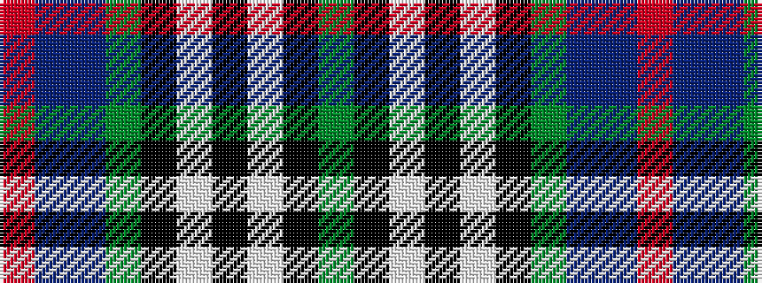

GKWKWKGBBR

It is a 10 stripe tartan.

<figure class="pat-woven">

<figcaption>idealised sample</figcaption>
</figure>

## Colour Sequence



## Tartans with this colour sequence

| Tartans |
|---------------|
| [Mitsukoshi](/setts/s10/y12k3w3k3w3k3y13n6db17r3~x2/)|
||
