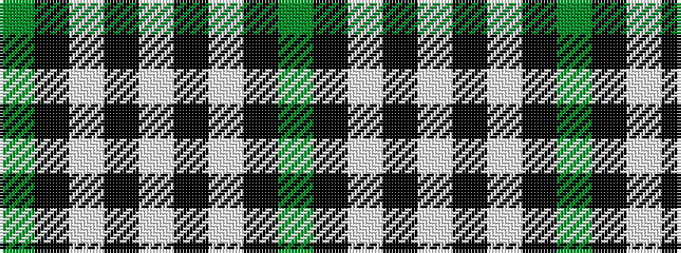

GKWKWKWKG

It is a 9 stripe tartan.

<figure class="pat-woven">

<figcaption>idealised sample</figcaption>
</figure>

## Colour Sequence



## Tartans with this colour sequence

| Tartans |
|---------------|
| [Jensen, Sven (Personal)](/setts/s9/g12k8w6k22w3k8w3k40g6/)|
||
