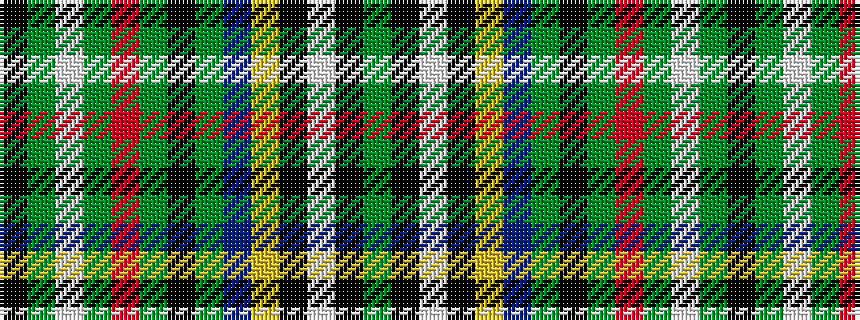

GKWKYBGKGRGWGK

It is a 14 stripe tartan.

<figure class="pat-woven">

<figcaption>idealised sample</figcaption>
</figure>

## Colour Sequence



## Tartans with this colour sequence

| Tartans |
|---------------|
| [Scott, Green (Clan)](/variants/s14/k8g3w3g3r3g12k8g6db12ly4k6w3k3g8~x2/)|
||
